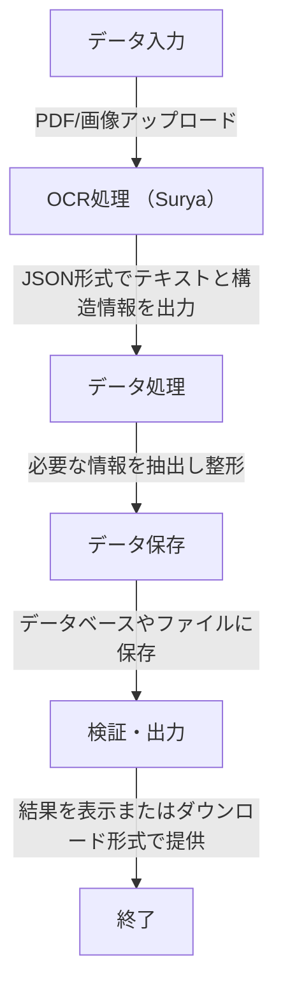

```bash
/project-root
│
├── /data                      # 入力データと出力結果を保存
│   ├── /input                 # 元データ (PDF/画像ファイル)
│   ├── /output                # OCR後のデータや最終出力
│   │   ├── /raw               # Suryaからの生データ (JSON)
│   │   ├── /structured        # 整形された構造化データ (JSON/CSV)
│   │   └── /snapshots         # スナップショット (画像やPDFの切り出し)
│
├── /scripts                   # Pythonスクリプト
│   ├── ocr.py                 # OCR実行スクリプト (Surya呼び出し)
│   ├── process_data.py        # JSONデータを解析し、構造化データを作成
│   ├── save_to_db.py          # データベースへの保存スクリプト
│   ├── validate_output.py     # データ検証・結果表示用スクリプト
│   └── utils.py               # 共通関数 (例: ログ記録, エラーハンドリング)
│
├── /models                    # サードパーティや自作のモデル
│   ├── /surya                 # Surya関連ファイル (必要ならForkしたもの)
│   └── custom                 # 必要なら独自モデルや補助スクリプト
│
├── /tests                     # テスト用スクリプト
│   ├── test_ocr.py            # OCRの単体テスト
│   ├── test_data_processing.py# データ処理の単体テスト
│   └── test_integration.py    # システム全体の結合テスト
│
├── /config                    # 設定ファイル
│   ├── settings.py            # 環境変数や設定値
│   ├── db_config.json         # データベース接続設定
│   └── ocr_config.json        # OCR (Surya) のパラメータ設定
│
├── requirements.txt           # Python依存関係
├── README.md                  # プロジェクト概要
├── LICENSE                    # ライセンス情報
└── main.py                    # エントリーポイント (全処理を統合して実行)

```


